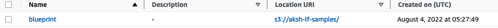

## Create Cluster
```shell
aws emr create-cluster \
 --name "delta-lake-demo-2" \
 --release-label "emr-6.10.0" \
 --service-role "arn:aws:iam::ACCOUNT_ID:role/service-role/AmazonEMR-ServiceRole-20230420T153422" \
 --ec2-attributes '{"InstanceProfile":"AmazonEMR-InstanceProfile-20230420T153403","EmrManagedMasterSecurityGroup":"sg-09209e292c3dc4feb","EmrManagedSlaveSecurityGroup":"sg-083268002a9e01f96","KeyName":"aksh-mumbai","AdditionalMasterSecurityGroups":[],"AdditionalSlaveSecurityGroups":[],"SubnetId":"subnet-e07553ac"}' \
 --tags 'for-use-with-amazon-emr-managed-policies=true' \
 --applications Name=Hadoop Name=Hive Name=Spark \
 --configurations '[{"Classification":"delta-defaults","Properties":{"delta.enabled":"true"}},{"Classification":"hive-site","Properties":{"hive.metastore.client.factory.class":"com.amazonaws.glue.catalog.metastore.AWSGlueDataCatalogHiveClientFactory"}},{"Classification":"spark-hive-site","Properties":{"hive.metastore.client.factory.class":"com.amazonaws.glue.catalog.metastore.AWSGlueDataCatalogHiveClientFactory"}}]' \
 --instance-groups '[{"InstanceCount":1,"InstanceGroupType":"MASTER","Name":"Primary","InstanceType":"m5.xlarge","EbsConfiguration":{"EbsBlockDeviceConfigs":[{"VolumeSpecification":{"VolumeType":"gp2","SizeInGB":32},"VolumesPerInstance":2}]}},{"InstanceCount":1,"InstanceGroupType":"TASK","Name":"Task - 1","InstanceType":"m5.xlarge","EbsConfiguration":{"EbsBlockDeviceConfigs":[{"VolumeSpecification":{"VolumeType":"gp2","SizeInGB":32},"VolumesPerInstance":2}]}},{"InstanceCount":1,"InstanceGroupType":"CORE","Name":"Core","InstanceType":"m5.xlarge","EbsConfiguration":{"EbsBlockDeviceConfigs":[{"VolumeSpecification":{"VolumeType":"gp2","SizeInGB":32},"VolumesPerInstance":2}]}}]' \
 --scale-down-behavior "TERMINATE_AT_TASK_COMPLETION" \
 --auto-termination-policy '{"IdleTimeout":14400}' \
 --os-release-label "2.0.20230504.1" \
 --region "ap-south-1"
```
## Run PySpark Job with Glue Catalog
```shell
pyspark     \
--conf "spark.sql.extensions=io.delta.sql.DeltaSparkSessionExtension"     \
--conf "spark.sql.catalog.spark_catalog=org.apache.spark.sql.delta.catalog.DeltaCatalog" \
--py-files /usr/lib/spark/jars/delta-core.jar 
```
### Chosing the glue database
**Resolving - IllegalArgumentException: Can not create a Path from an empty string**

Refer https://docs.aws.amazon.com/emr/latest/ReleaseGuide/Deltaconsiderations-limitations.html
If you create a database in the AWS Glue Data Catalog outside of Apache Spark, the database could have an empty LOCATION field. Because Spark doesn't allow databases to be created with an empty location property, you'll get the following error if you use Spark in Amazon EMR to create a Delta table in a Glue database and the database has an empty LOCATION property:

**IllegalArgumentException: Can not create a Path from an empty string**

To resolve this issue, create the database in the Data Catalog with a valid, non-empty path for the LOCATION field. For steps to implement this solution, see Illegal argument exception when creating a table in the Amazon Athena User Guide.

 

```python
data =  spark.createDataFrame([("100", "2015-01-01", "2015-01-01T13:51:39.340396Z"),
                               ("101",  "2015-01-01", "2015-01-01T12:14:58.597216Z"),
                               ("102", "2015-01-01", "2015-01-01T13:51:40.417052Z"),
                               ("103",  "2015-01-01",  "2015-01-01T13:51:40.519832Z")],
                              ["id", "creation_date",  "last_update_time"])

data.show()
data.printSchema()
spark.catalog.setCurrentDatabase("blueprint")
```
```python
spark.sql("""CREATE  TABLE IF NOT EXISTS delta_table_demo_2(id string, creation_date string,
last_update_time string)
USING delta location
's3://akshaya-delta-lake/delta_table_demo_2/db/delta_table'""");

data.write.format("delta").mode("append").saveAsTable("delta_table_demo_2")
```
```python
from delta.tables import *
deltaTable = DeltaTable.forPath(spark, "s3://akshaya-delta-lake/delta_table_demo_2/db/delta_table")
deltaTable.toDF().show()
deltaTable.history().show()
```


### Symlink Creation
```python
deltaTable.generate("symlink_format_manifest")  
```

### Create table form symlink
```python
spark.sql("""CREATE  TABLE IF NOT EXISTS delta_table_demo_sym(id string, creation_date string,
last_update_time string)
ROW FORMAT SERDE 'org.apache.hadoop.hive.ql.io.parquet.serde.ParquetHiveSerDe'
STORED AS INPUTFORMAT 'org.apache.hadoop.hive.ql.io.SymlinkTextInputFormat'
OUTPUTFORMAT 'org.apache.hadoop.hive.ql.io.HiveIgnoreKeyTextOutputFormat'
location
's3://akshaya-delta-lake/delta_table_demo_2/db/delta_table/_symlink_format_manifest/'""");
```
